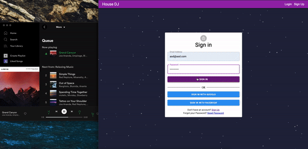

# House DJ

This app lets the users host a music party where they can listen to music that everyone likes.

A host can create a room and share the code with everyone to join the room. The host can choose whether the members joining the room can play/pause music and number of votes required to skip a song. The Host needs to login to their Spotify account in order to use use this app.

Members can join the room using the code and they can vote to skip the music or to play/pause music (if allowed by the host).

## Project Setup

1. Install and start virtual environment:
	```
	pip install virtualenv
	python -m virtualenv venv
	source venv/bin/activate
	```

2. Install required packages for Django server:
	```
	pip install requirements
	```
	Make sure the right version of python is installed. This project uses python 3.
	
3. Run migrations and start the Django server:
	```
	cd music_controller
	python manage.py makemigrations
	python manage.py migrate
	python manage.py runserver
	```

4. Build frontend react app:
	```
	cd music_controller/client
	npm run build
	```
5. Project will be hosted on `localhost:8000`

Note:
To use social authentication or Spotify APIs you fill in required client ids and client secrets.


### Example of host using the app
